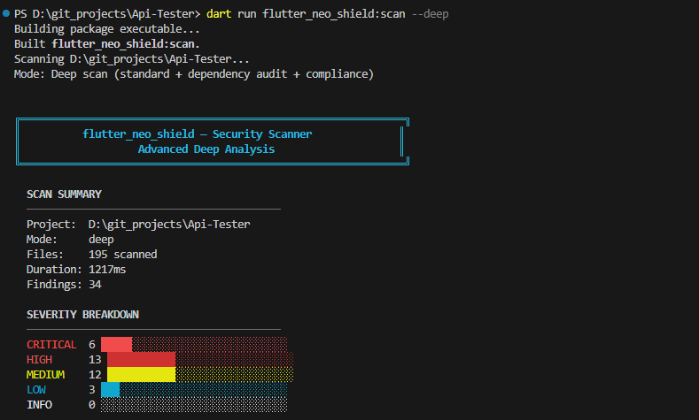

<p align="center">
  
  
  
  
  
</p>

# flutter_neo_shield

### The most comprehensive client-side security toolkit for Flutter.

**27 shields + CLI security scanner. 6 platforms. Zero backend. Zero API keys. 100% offline.**

Runtime protection, PII scrubbing, encrypted storage, biometric auth, anti-tampering, certificate pinning, fake GPS detection, screenshot blocking, keylogger defense, and more — all native.

---

> **v2.1.1** — NEW: CLI Security Scanner with 90+ rules, 11 categories, 5 output formats. Run `dart run flutter_neo_shield:scan`.

---

## CLI Security Scanner

Scan your Flutter project for **90+ security vulnerabilities** across 11 categories — from the command line.



```bash
# Standard scan (all categories)
dart run flutter_neo_shield:scan

# Quick scan (secrets + network only — fast CI gate)
dart run flutter_neo_shield:scan --quick

# Deep scan (standard + dependency audit + compliance)
dart run flutter_neo_shield:scan --deep

# CI mode — exit code 1 if critical/high findings
dart run flutter_neo_shield:scan --deep --ci

# Export as JSON / SARIF / HTML / JUnit XML
dart run flutter_neo_shield:scan --format json --output report.json
dart run flutter_neo_shield:scan --format sarif --output results.sarif.json
dart run flutter_neo_shield:scan --format html --output report.html
dart run flutter_neo_shield:scan --format junit --output results.xml

# List all 90+ rules
dart run flutter_neo_shield:scan --list-rules
```

### 11 Scan Categories

| # | Category | Rules | What it detects |
|---|----------|:-----:|-----------------|
| 1 | **Hardcoded Secrets** | 12 | API keys, tokens, passwords, private keys, database URIs, Firebase creds, cloud keys, webhooks, encryption keys |
| 2 | **Insecure Network** | 9 | HTTP URLs, disabled cert validation, missing pinning, cleartext traffic, WebSocket without TLS, CORS wildcard |
| 3 | **Insecure Storage** | 9 | SharedPreferences secrets, unencrypted SQLite/Hive, web localStorage, logging PII, secrets in assets |
| 4 | **Platform Config** | 10 | Debuggable flag, exported components, backup enabled, ATS disabled, missing ProGuard, low minSdk |
| 5 | **Auth & Session** | 7 | Biometric without crypto, token in URL, missing expiry, insecure deep links, hardcoded credentials |
| 6 | **Cryptography** | 8 | MD5/SHA1, ECB mode, static IV, weak key derivation, insecure Random(), custom crypto, predictable seeds |
| 7 | **Code Injection** | 8 | SQL injection, XSS in WebView, command injection, path traversal, unsafe deserialization, ReDoS |
| 8 | **Dependency Chain** | 7 | Unpinned versions, dependency confusion, git deps without hash, dependency_overrides |
| 9 | **Privacy** | 7 | PII in logs, analytics without consent, device fingerprinting, clipboard PII exposure |
| 10 | **Build & Release** | 6 | Source maps exposed, .env committed, keystore password in gradle, test code in production |
| 11 | **Flutter Specific** | 7 | Unprotected MethodChannel, app switcher state, WebView JS bridge, async gap, global mutable secrets |

### 5 Output Formats

| Format | Flag | Best for |
|--------|------|----------|
| **ASCII** | `--format ascii` | Terminal — color-coded with severity bars, score card, grade |
| **JSON** | `--format json` | CI/CD pipelines, custom tooling |
| **SARIF** | `--format sarif` | GitHub Advanced Security integration |
| **HTML** | `--format html` | Shareable audit reports with dark theme |
| **JUnit XML** | `--format junit` | Jenkins, GitLab CI, Azure DevOps test results |

### Security Score

Every scan produces a **security score (0-100)** and **letter grade (A-F)**:
- **A (90-100):** No critical/high issues
- **B (80-89):** Minor issues only
- **C (70-79):** Some medium-severity issues
- **D (60-69):** Multiple issues need attention
- **F (<60):** Critical security gaps

---

## All 27 Shields at a Glance

### Core Protection

| # | Shield | What it does |
|---|--------|-------------|
| 1 | **Log Shield** | Replace `print()` with `shieldLog()` — auto-hides 16 PII types in release builds |
| 2 | **Clipboard Shield** | Auto-clears clipboard after X seconds, detects PII on copy |
| 3 | **Memory Shield** | Stores secrets as bytes, overwrites with zeros on dispose |
| 4 | **String Shield** | Compile-time string obfuscation — `strings libapp.so` reveals nothing |

### Runtime Protection

| # | Shield | What it does |
|---|--------|-------------|
| 5 | **RASP Shield** | 10 native checks: root, debugger, emulator, Frida, hooks, integrity, dev mode, signature, native debug, network threats |
| 6 | **Screen Shield** | Blocks screenshots, recording, app-switcher thumbnails — OS-level APIs |
| 7 | **Location Shield** | 7-layer fake GPS detection: mock providers, spoofing apps, hooks, satellite analysis, sensor fusion, temporal anomalies |
| 8 | **RASP Monitor** | Continuous background watchdog — periodic scans detect threats that appear after launch |
| 9 | **Threat Response** | Automated incident response — wipe secrets, wipe storage, kill app on critical threats |

### Input & UI Protection

| # | Shield | What it does |
|---|--------|-------------|
| 10 | **Overlay Shield** | Detects tapjacking overlays, enables touch filtering when window is obscured |
| 11 | **Accessibility Shield** | Detects non-system accessibility services that can read your screen |
| 12 | **Secure Input Shield** | Anti-keylogger: detects third-party keyboards, provides `SecureTextField` widget |
| 13 | **Watermark Shield** | Invisible screenshot watermarks — trace leakers instead of blocking |
| 14 | **Security Dashboard** | Visual debug widget showing all RASP checks in real-time |

### Data & Crypto Protection

| # | Shield | What it does |
|---|--------|-------------|
| 15 | **Secure Storage Shield** | Keychain/Keystore-backed encrypted key-value storage |
| 16 | **Biometric Shield** | Crypto-bound biometric auth (Face ID, Touch ID, fingerprint) |
| 17 | **Encryption Shield** | AES-256 encryption for local data — strings, bytes, JSON |
| 18 | **DLP Shield** | Data leak prevention — sanitize deep links, intents, share data |

### Network & Supply Chain

| # | Shield | What it does |
|---|--------|-------------|
| 19 | **Certificate Pinning Shield** | Pin TLS certificates to SHA-256 hashes — prevent MITM |
| 20 | **WebView Shield** | URL validation, HTTPS enforcement, host allowlisting |
| 21 | **DNS Shield** | Pin domains to expected IPs — detect DNS spoofing |
| 22 | **TLS Shield** | Enforce TLS 1.2+, validate server configurations |

### Build & Integrity

| # | Shield | What it does |
|---|--------|-------------|
| 23 | **Device Binding Shield** | SHA-256 device fingerprint — bind tokens to specific devices |
| 24 | **Code Injection Shield** | Detect dynamic DEX/dylib/DLL loading at runtime |
| 25 | **Obfuscation Shield** | Verify ProGuard/Dart obfuscation was properly applied |
| 26 | **Permission Shield** | Monitor camera/mic/location abuse by other apps |
| 27 | **Dependency Shield** | Verify package checksums against known-good hashes |

### Platform Coverage

| Shield | Android | iOS | macOS | Windows | Linux | Web |
|--------|:-------:|:---:|:-----:|:-------:|:-----:|:---:|
| RASP (10 checks) | Native | Native | Native | Native | Native | JS |
| Screen | FLAG_SECURE | Secure Layer | NSWindow | WDA | Best-effort | CSS |
| Location (7 layers) | Full | Full | 4 layers | 4 layers | 4 layers | 2 layers |
| Secure Storage | AES-GCM | Keychain | Keychain | DPAPI | Encrypted | Memory |
| Biometric | BiometricPrompt | LAContext | - | - | - | - |
| Device Binding | SHA-256 | SHA-256 | SHA-256 | SHA-256 | SHA-256 | JS |
| Code Injection | DEX scan | dylib scan | dylib scan | DLL scan | LD_PRELOAD | - |
| Overlay | Overlay detect | OS-level | - | - | - | iframe |
| Accessibility | AccessibilityMgr | UIAccessibility | AX API | SPI | AT-SPI | - |
| Secure Input | IME detect | Keyboard ext | Carbon | Layout | Process | - |

---

## Quick Start

```yaml
# pubspec.yaml
dependencies:
  flutter_neo_shield: ^2.1.1
```

```dart
import 'package:flutter_neo_shield/flutter_neo_shield.dart';

void main() async {
  WidgetsFlutterBinding.ensureInitialized();

  // Initialize all shields
  FlutterNeoShield.init(
    screenConfig: ScreenShieldConfig(blockScreenshots: true),
  );

  // Run security scan
  final report = await RaspShield.fullSecurityScan();
  if (!report.isSafe) {
    // Handle threats
    ThreatResponse.instance.wipeSecrets();
  }

  // Start continuous monitoring
  RaspMonitor.instance.startMonitoring(
    interval: Duration(seconds: 30),
    onThreat: (report) => print('Threat: $report'),
  );

  runApp(MyApp());
}
```

---

## What is PII?

PII = **Personally Identifiable Information**. Things like:

- Email addresses (`john@gmail.com`)
- Phone numbers (`+1 555-123-4567`)
- Credit card numbers (`4532 0151 1283 0366`)
- Social Security Numbers (`123-45-6789`)
- Passwords, API keys, tokens, IP addresses, dates of birth

If any of this data leaks (through logs, clipboard, or memory), it's a security risk.

**flutter_neo_shield auto-detects and hides 16+ PII types.**

---

## How Each Module Works (Simple Explanation)

### 1. Log Shield — "Safe print()"

**The problem:**

During development, you often print things to the debug console:

```dart
print('User logged in: john@gmail.com with token: Bearer sk-abc123');
```

This prints the **real email and token** to the console. If you forget to remove
this print statement before releasing your app, the same data ends up in crash
reporting services (Crashlytics, Sentry, etc.) — that's a data leak.

**How Log Shield fixes it:**

You replace `print()` with `shieldLog()`. It gives you structured, PII-safe logging:

- **During development** (`flutter run`): `shieldLog()` shows all real values normally for debugging.
- **In release builds** (`flutter build`): The same `shieldLog()` call **automatically hides sensitive data** — or stays completely silent.

**You write the code once. It does the right thing in each mode automatically.**

```dart
shieldLog('User logged in: john@gmail.com with token: Bearer sk-abc123');

// BY DEFAULT — PII is hidden in all modes (debug + release):
// → [INFO] User logged in: [EMAIL HIDDEN] with token: Bearer [TOKEN HIDDEN]
```

**You don't need to change any code between dev and production.** Just use
`shieldLog()` everywhere instead of `print()`, and it handles both modes.

> **Note:** If you want to see real values during development (e.g., for local
> debugging), set `sanitizeInDebug: false`:
> ```dart
> FlutterNeoShield.init(
>   logConfig: LogShieldConfig(sanitizeInDebug: false),
> );
> // Debug output: [INFO] User logged in: john@gmail.com (real value!)
> ```

**What it auto-detects and hides (in release mode):**

| Your input | What release console shows |
|------------|---------------------------|
| `john@gmail.com` | `[EMAIL HIDDEN]` |
| `+1 555-123-4567` | `[PHONE HIDDEN]` |
| `123-45-6789` | `[SSN HIDDEN]` |
| `4532015112830366` | `[CARD HIDDEN]` |
| `eyJhbGciOi...` (JWT) | `[JWT HIDDEN]` |
| `Bearer sk-abc123` | `Bearer [TOKEN HIDDEN]` |
| `password=secret` | `password=[HIDDEN]` |
| `sk_live_abc123...` | `[API_KEY HIDDEN]` |
| `1985-03-15` | `[DOB HIDDEN]` |
| `192.168.1.1` | `[IP HIDDEN]` |
| `GB29 NWBK 6016 1331 9268 19` | `[IBAN HIDDEN]` |
| `AB 12 34 56 C` (UK NIN) | `[NI NUMBER HIDDEN]` |
| `123-456-789` (Canadian SIN) | `[SIN HIDDEN]` |
| `A12345678` (Passport) | `[PASSPORT HIDDEN]` |

---

### 2. Clipboard Shield — "Auto-delete clipboard"

**The problem:**

Imagine your app has a "Copy API Key" button. The user taps it, and the API key goes to the clipboard. Now that key **stays on the clipboard forever** — until the user copies something else. Any other app on the phone can read it.

**How Clipboard Shield fixes it:**

Instead of using Flutter's `Clipboard.setData()`, you use `ClipboardShield().copy()`. It copies the text normally, but **starts a countdown timer**. After the timer expires (e.g., 15 seconds), it automatically clears the clipboard.

```dart
// BEFORE (unsafe):
Clipboard.setData(ClipboardData(text: 'sk-my-secret-api-key'));
// The API key stays on clipboard FOREVER until user copies something else.

// AFTER (safe):
await ClipboardShield().copy('sk-my-secret-api-key', expireAfter: Duration(seconds: 15));
// The API key is copied to clipboard.
// After 15 seconds → clipboard is automatically cleared (emptied).
// Bonus: it also tells you "hey, that text contained an API key" (PII detection).
```

**It also gives you ready-made widgets:**

```dart
// A button that copies text securely when tapped:
SecureCopyButton(
  text: 'sk-my-secret-api-key',
  expireAfter: Duration(seconds: 15),
  child: ElevatedButton(onPressed: null, child: Text('Copy Key')),
)

// A text field that clears the clipboard after the user pastes into it:
SecurePasteField(
  decoration: InputDecoration(labelText: 'Paste password'),
  clearAfterPaste: true,  // clipboard is emptied right after paste
)
```

---

### 3. Memory Shield — "Shred the secret when done"

**The problem:**

When you store a password or API key in a normal Dart `String`, it stays in your phone's RAM (memory) even after you stop using it. Dart's garbage collector eventually removes it, but it does NOT overwrite the bytes — the secret just sits there in memory until something else happens to write over that spot.

This is a risk because memory dump attacks or debugging tools can read old values from RAM.

**How Memory Shield fixes it:**

Instead of a normal `String`, you use `SecureString`. It stores the text as raw bytes. When you call `.dispose()`, it **overwrites every byte with zero** — the secret is actually destroyed, not just forgotten.

```dart
// BEFORE (unsafe):
String apiKey = 'sk-my-secret-key';
// ... use it ...
apiKey = '';  // You THINK it's gone, but the old bytes are still in RAM!

// AFTER (safe):
final apiKey = SecureString('sk-my-secret-key');
print(apiKey.value);  // Use it: 'sk-my-secret-key'
apiKey.dispose();     // Every byte overwritten with 0. Actually gone.
apiKey.value;         // Throws error — can't read disposed secret.
```

**Extra features:**

```dart
// Use a secret once, then it auto-destroys:
final result = SecureString('password123').useOnce((password) {
  return hashPassword(password);  // Use the password
});
// password123 is already wiped from memory here

// Auto-destroy after 5 minutes:
final temp = SecureString('session-token', maxAge: Duration(minutes: 5));

// Wipe ALL secrets at once (e.g., on logout):
MemoryShield().disposeAll();
```

---

### 4. String Shield — "Hide strings from reverse engineers"

**The problem:**

Flutter's `--obfuscate` flag only obfuscates class and method names. String literals — API URLs, keys, config values — remain in **plain text** in the compiled binary. An attacker runs `strings libapp.so` and sees everything:

```
https://api.myapp.com/v2
sk_live_abc123xyz
my-secret-salt
```

**How String Shield fixes it:**

You annotate your secret strings with `@Obfuscate()`. At build time (via `build_runner`), the generator replaces each string with encrypted byte arrays. At runtime, they're transparently decrypted when accessed.

```dart
import 'package:flutter_neo_shield/string_shield.dart';

part 'secrets.g.dart';

@ObfuscateClass()
abstract class AppSecrets {
  @Obfuscate()
  static const String apiUrl = 'https://api.myapp.com/v2';

  @Obfuscate(strategy: ObfuscationStrategy.enhancedXor)
  static const String apiKey = 'sk_live_abc123xyz';
}

// Usage — transparent, just like accessing a normal field:
final url = $AppSecrets.apiUrl;  // decrypted at runtime
```

Run `dart run build_runner build` and the generator creates `secrets.g.dart` with encrypted data. Now `strings libapp.so` shows random bytes instead of your secrets.

**Three obfuscation strategies:**

| Strategy | How it works | Best for |
|----------|-------------|----------|
| `xor` (default) | XOR with random key | Most strings — fast, stops `strings` command |
| `enhancedXor` | XOR + reverse + junk bytes | High-value secrets — harder pattern analysis |
| `split` | Split into shuffled chunks | Strings that must never appear contiguously |

**Setup for String Shield:**

```yaml
# pubspec.yaml
dev_dependencies:
  build_runner: ^2.4.0
```

Then run: `dart run build_runner build`

---

### 5. RASP Shield — "Runtime App Self Protection"

**The problem:**

Attackers often install your app on a rooted device or emulator, attach a debugger, or inject tools like [Frida](https://frida.re/) to hook into your app's memory and steal API keys or bypass paywalls.

**How RASP Shield fixes it:**

It detects these hostile environments so you can restrict features, clear sensitive data, or crash the app.

> **Fail-closed by default:** If native RASP plugins aren't registered (e.g., running on web/desktop), all checks report threats as detected. Use `RaspChannel.configure(failClosed: false)` during development to change this.


```dart
import 'package:flutter_neo_shield/rasp_shield.dart';

// Perform a full security scan on startup:
// In strict mode, throws SecurityException if any threat is detected.
final report = await RaspShield.fullSecurityScan(mode: SecurityMode.strict);

// Or use warn mode to log threats and continue:
final report = await RaspShield.fullSecurityScan(mode: SecurityMode.warn);

// Or silent mode with manual handling:
final report = await RaspShield.fullSecurityScan();
if (!report.isSafe) {
  print('SECURITY WARNING: Unsafe environment detected!');

  if (report.debuggerDetected) print('Debugger attached!');
  if (report.rootDetected) print('Device is rooted/jailbroken!');
  if (report.emulatorDetected) print('Running on emulator!');
  if (report.fridaDetected) print('Frida instrumentation detected!');
  if (report.hookDetected) print('Hooking framework (Substrate/Xposed) detected!');
  if (report.integrityTampered) print('App binary was tampered/sideloaded!');
  if (report.developerModeDetected) print('Developer Options / Developer Mode is enabled!');
  if (report.signatureTampered) print('APK/IPA re-signed with different certificate!');
  if (report.nativeDebugDetected) print('Native debugger (GDB/LLDB) attached from desktop!');
  if (report.networkThreatDetected) print('Proxy or VPN detected — possible MITM attack!');
}
    // Exit the app
    _terminateApp();

```

You can also run independent checks before sensitive actions (like processing a payment):

```dart
if ((await RaspShield.checkFrida()).isDetected) {
  throw Exception("Payment blocked: Security risk.");
}
```

#### Anti-Repackaging (Signature Verification)

The **#1 attack** on APKs: decompile with `apktool`/`jadx`, modify code, re-sign with a different key. Signature verification catches this:

```dart
// Check if someone re-signed your APK/IPA
if ((await RaspShield.checkSignature()).isDetected) {
  // APK was repackaged — kill the app or restrict features
}

// Get your signing certificate hash during development:
final hash = await RaspShield.getSignatureHash();
print('My signing cert SHA-256: $hash');
// Use this hash for strict verification in production
```

**What it detects (Android):** Debug certificates, multiple signers, certificate hash mismatch.
**What it detects (iOS):** Missing/corrupt CodeResources, `get-task-allow` entitlement, `DYLD_INSERT_LIBRARIES` injection.
**What it detects (macOS):** `SecCodeCopySelf` + `SecStaticCodeCheckValidity`, DYLD environment variables, `get-task-allow` entitlement, re-sign indicators.
**What it detects (Windows):** `WinVerifyTrust` Authenticode verification, PE image checksum validation, `CryptQueryObject` certificate chain and self-signed detection.
**What it detects (Linux):** ELF magic verification, `LD_PRELOAD`/`LD_LIBRARY_PATH`/`LD_AUDIT` injection detection.
**What it detects (Web):** `Function.prototype.bind` / `Object.prototype.toString` tampering (prototype monkey-patching).

#### Native Debugger Detection

Goes deeper than `checkDebugger()` — catches **GDB, LLDB, strace** attached from a desktop via USB/ADB:

```dart
if ((await RaspShield.checkNativeDebug()).isDetected) {
  // Native debugger attached from desktop!
}
```

**Android:** `/proc/self/status` TracerPid, `/proc/self/wchan` ptrace_stop, timing anomaly.
**iOS:** Mach exception port enumeration, timing anomaly, `PT_DENY_ATTACH` support.
**macOS:** `ptrace(PT_DENY_ATTACH)`, `sysctl P_TRACED`, `task_get_exception_ports`, parent process check, timing anomaly.
**Windows:** `NtQueryInformationProcess(ProcessDebugPort/ProcessDebugObjectHandle)`, DR0-DR3 hardware breakpoint registers, timing anomaly.
**Linux:** `/proc/self/status` TracerPid, `PTRACE_TRACEME`, `/proc/self/wchan`, timing anomaly.
**Web:** Computation timing anomaly detection (debugger stepping causes measurable delays).

#### Proxy & VPN Detection (Anti-MITM)

Detects Burp Suite, mitmproxy, Charles Proxy, and VPN tunnels — the tools attackers use to intercept your HTTPS traffic from their desktop:

```dart
if ((await RaspShield.checkNetworkThreats()).isDetected) {
  // Proxy or VPN active — possible MITM interception
}
```

**Android:** System proxy properties, ConnectivityManager, global proxy settings, VPN transport, tun/ppp interfaces.
**iOS:** CFNetwork proxy settings (HTTP/HTTPS/SOCKS), utun/ppp/ipsec network interfaces.
**macOS:** `SCDynamicStoreCopyProxies` (HTTP/HTTPS/SOCKS proxy), environment variables (`http_proxy`, etc.), `getifaddrs` VPN interfaces (utun/ppp/ipsec/tap/tun).
**Windows:** `WinHttpGetIEProxyConfigForCurrentUser`, `GetAdaptersInfo` VPN adapter detection, environment variables.
**Linux:** Proxy environment variables, `getifaddrs` VPN interfaces (tun/tap/ppp/wg).
**Web:** WebRTC availability check (VPN/privacy extensions block `RTCPeerConnection`).

---

### 6. Screen Shield — "Block screenshots & screen recording"

**The problem:**

Your app shows sensitive data — bank balances, OTPs, medical records, credit card numbers. A malicious app (or even the user) can screenshot or screen-record this data. On Android, any app with `MEDIA_PROJECTION` permission can silently record your screen. On iOS, the built-in screen recorder or AirPlay mirroring can capture everything.

Even the **app switcher** (recent apps view) takes a snapshot of your screen — so when the user presses the home button, your sensitive data is visible as a thumbnail to anyone looking at the phone.

**How Screen Shield fixes it:**

It uses OS-level APIs to make your app's content **invisible to all capture methods**:

- **Android:** Sets `FLAG_SECURE` on the Activity window. The OS itself renders a **black screen** for any capture — screenshots, screen recording, Chromecast, `adb screencap`, and the app switcher thumbnail. This works on all Android versions.
- **iOS:** Uses a `UITextField` with `isSecureTextEntry = true` as a rendering layer. The OS treats content in this layer as DRM-protected and **blanks it during capture**. This is the same technique used by banking apps. Additionally, a blur overlay is shown in the app switcher.

---

### 🎬 See Screen Shield in Action


---


**Simplest usage — protect the entire app:**

```dart
void main() {
  WidgetsFlutterBinding.ensureInitialized();
  FlutterNeoShield.init(
    screenConfig: ScreenShieldConfig(
      blockScreenshots: true,    // Block screenshots
      blockRecording: true,      // Block screen recording
      guardAppSwitcher: true,    // Blur content in app switcher
    ),
  );
  runApp(MyApp());
}
// That's it. Every screen in your app is now protected.
```

**Per-screen protection — only protect sensitive screens:**

```dart
// Wrap only the screens that show sensitive data:
class PaymentScreen extends StatelessWidget {
  @override
  Widget build(BuildContext context) {
    return ScreenShieldScope(
      enableProtection: true,       // Block capture on this screen
      guardAppSwitcher: true,       // Blur in app switcher
      onScreenshot: () {            // Called when screenshot is taken (iOS only)
        ScaffoldMessenger.of(context).showSnackBar(
          SnackBar(content: Text('Screenshots are not allowed on this screen')),
        );
      },
      child: Scaffold(
        body: PaymentForm(),        // This content will be black in screenshots
      ),
    );
  }
}
// When the user navigates away from PaymentScreen, protection is auto-disabled.
```

**Toggle protection dynamically — e.g., protect only during OTP display:**

```dart
// Show OTP — enable protection
await FlutterNeoShield.screen.enableProtection();

// ... user enters OTP ...

// OTP consumed — disable protection
await FlutterNeoShield.screen.disableProtection();
```

**Detect screen recording (iOS) — e.g., pause sensitive content:**

```dart
FlutterNeoShield.screen.onRecordingStateChanged.listen((event) {
  if (event.isRecording) {
    // Someone started screen recording!
    // Navigate away, pause video, or show a warning
    Navigator.of(context).pushReplacement(
      MaterialPageRoute(builder: (_) => RecordingBlockedScreen()),
    );
  }
});
```

**What each platform does when you enable protection:**

| Action | Android | iOS | macOS | Windows | Linux | Web |
|--------|---------|-----|-------|---------|-------|-----|
| User takes screenshot | **Black screen** | **Blank content** | **Excluded from capture** | **Excluded from capture** | Best-effort | CSS protection |
| User starts screen recording | **Black screen** | **Blanked** + event fires | **Excluded** | **Excluded** | Best-effort | CSS protection |
| User Chromecasts / AirPlays | **Black screen** | **Blank** on TV | N/A | N/A | N/A | N/A |
| App in recent apps / switcher | **Black** thumbnail | **Blurred** | N/A | N/A | N/A | N/A |
| `adb screencap` / dev tools | **Black screen** | N/A | N/A | N/A | N/A | N/A |
| Print (Ctrl+P) | N/A | N/A | N/A | N/A | N/A | **Blocked** |

**Desktop screen protection mechanisms:**
- **macOS:** `NSWindow.sharingType = .none` — OS-level exclusion from all capture methods.
- **Windows:** `SetWindowDisplayAffinity(WDA_EXCLUDEFROMCAPTURE)` with `WDA_MONITOR` fallback — prevents screenshots, recording, and remote desktop capture.
- **Linux:** Best-effort (no universal screen capture prevention API on Linux).
- **Web:** CSS-based (`user-select: none`, print media hiding, right-click/print shortcut blocking). Limited effectiveness against determined attackers.

> **Note:** No software can prevent someone from pointing a camera at their phone screen. Screen Shield blocks all **digital** capture methods.

---

### 7. Location Shield — "Detect Fake GPS / Mock Location"

**The problem:**

Attackers use mock location apps, Xposed modules, Frida scripts, and jailbreak tweaks to fake their GPS coordinates. This breaks location-based features like geofencing, delivery tracking, and fraud prevention.

**The solution:**

Location Shield uses **7 native detection layers** running below the Dart VM where Frida/Xposed can't easily hook:

```dart
import 'package:flutter_neo_shield/flutter_neo_shield.dart';

// One-shot check — runs all 7 layers
final verdict = await LocationShield.instance.checkLocationAuthenticity();

if (verdict.isSpoofed) {
  print('FAKE LOCATION! Confidence: ${verdict.confidence}');
  print('Methods: ${verdict.detectedMethods}');
  // e.g., ["mockProvider", "spoofingApp", "sensorFusion"]
}

// Check for spoofing apps (no location permission needed)
final apps = await LocationShield.instance.checkSpoofingApps();
if (apps.detected) {
  print('Spoofing apps found: ${apps.detectedApps}');
}

// Full scan combining RASP + Location (highest confidence)
final fullVerdict = await LocationShield.instance.fullLocationSecurityScan();
print('Risk level: ${fullVerdict.riskLevel}'); // none, low, medium, high, critical
```

**Detection Layers:**

| Layer | What it checks |
|-------|---------------|
| 1. Mock Provider | Developer settings, `isMock` flag, test providers, mock location app ops |
| 2. Spoofing Apps | 30+ known GPS faker packages (Android), jailbreak tweaks/dylibs (iOS) |
| 3. Location Hooks | Xposed method patching, Obj-C swizzle, ARM64 trampolines, `/proc/self/maps` |
| 4. GPS Signal | Satellite SNR uniformity, constellation diversity, impossible satellite counts |
| 5. Sensor Fusion | Accelerometer/gyro/barometer vs GPS — catches physics-violating spoofs |
| 6. Temporal Anomaly | Teleportation, impossible speed, bearing reversal, replay attacks |
| 7. Integrity | Weighted aggregation + cross-validation with RASP detectors |

**Platform depth:**

- **Android:** Full 7 layers (GNSS callbacks, reflection hook detection, sensor correlation)
- **iOS:** Full 7 layers (CoreMotion, `dladdr` swizzle detection, dylib injection scan)
- **macOS:** 4 layers (mock provider, hooks, temporal, integrity)
- **Windows/Linux:** 4 layers (process scanning, hook detection, temporal, integrity)
- **Web:** 2 layers (Geolocation API override detection, prototype tampering)

---

## Installation

**Step 1:** Add to `pubspec.yaml`:

```yaml
dependencies:
  flutter_neo_shield: ^2.0.0
```

**Step 2:** Run:

```bash
flutter pub get
```

**Step 3:** Initialize in `main.dart`:

```dart
import 'package:flutter_neo_shield/flutter_neo_shield.dart';

void main() {
  WidgetsFlutterBinding.ensureInitialized();
  FlutterNeoShield.init();  // That's it!
  runApp(MyApp());
}
```

**Step 4:** Start using it anywhere in your app:

```dart
// Instead of print():
shieldLog('Debug: user email is john@test.com');

// Instead of Clipboard.setData():
await ClipboardShield().copy('sensitive-text', expireAfter: Duration(seconds: 15));

// Instead of String for secrets:
final secret = SecureString('my-api-key');

// Protect strings in compiled binary:
// (see String Shield section above for full setup)
final url = $AppSecrets.apiUrl;  // decrypted at runtime

// Check if device is safe (RASP):
final report = await RaspShield.fullSecurityScan();
if (!report.isSafe) {
  // exit or restrict user
}

// Block screenshots & recording:
await FlutterNeoShield.screen.enableProtection();

// Or wrap a single screen:
ScreenShieldScope(child: SensitiveScreen())
```

---

## Real-World Example

Here's a typical Flutter app scenario — a login screen:

```dart
// ============================================
// WITHOUT flutter_neo_shield (unsafe)
// ============================================
Future<void> login(String email, String password) async {
  print('Login attempt: $email');              // LEAKS email in debug AND release!
  final token = await api.login(email, password);
  print('Got token: $token');                  // LEAKS token in debug AND release!
  final savedToken = token;                    // Token stays in RAM forever
}

// ============================================
// WITH flutter_neo_shield (safe — zero extra effort)
// ============================================
Future<void> login(String email, String password) async {
  shieldLog('Login attempt: $email');
  // Debug console:   [INFO] Login attempt: john@gmail.com   ← you see it for debugging!
  // Release console: [INFO] Login attempt: [EMAIL HIDDEN]   ← hidden in production!

  final token = await api.login(email, password);
  shieldLog('Got token: $token');
  // Debug console:   [INFO] Got token: eyJhbGci...          ← you see it for debugging!
  // Release console: [INFO] Got token: [JWT HIDDEN]         ← hidden in production!

  // Token stored securely — wiped from RAM on dispose:
  final savedToken = SecureString(token);
  savedToken.dispose();  // Bytes overwritten with zeros
}
```

**Notice:** You write the exact same code for dev and production. `shieldLog()`
automatically knows which mode you're in and does the right thing.

---

## New Shields (v2.0.0)

### 8. Overlay/Tapjacking Shield

Detects malicious overlays that steal taps on your app:

```dart
// Enable touch filtering — rejects touches when obscured
await OverlayShield.instance.enableTouchFiltering();

// Check for active overlay attacks
if (await OverlayShield.checkOverlayAttack()) {
  print('Warning: Overlay detected!');
}
```

### 9. Secure Input Shield (Anti-Keylogger)

Detects third-party keyboards and provides secure text input:

```dart
// Check for third-party keyboard
if (await SecureInputShield.isThirdPartyKeyboardActive()) {
  print('Warning: Non-system keyboard detected');
}

// Use secure text field (disables IME learning, suggestions, autocorrect)
SecureTextField(
  decoration: InputDecoration(labelText: 'Enter OTP'),
  obscureText: true,
)
```

### 10. Secure Storage Shield

Persistent encrypted storage using platform Keystore/Keychain:

```dart
final storage = SecureStorageShield.instance;

// Write encrypted
await storage.write(key: 'auth_token', value: 'eyJhbGci...');

// Read decrypted
final token = await storage.read(key: 'auth_token');

// Wipe everything on logout
await storage.wipeAll();
```

### 11. Biometric Shield

Crypto-bound biometric authentication:

```dart
final bio = BiometricShield.instance;

// Check availability
final avail = await bio.checkAvailability();
print('Types: ${avail.biometricTypes}'); // [faceID, touchID]

// Authenticate
final result = await bio.authenticate(reason: 'Confirm payment');
if (result.success) {
  // Proceed with payment
}
```

### 12. RASP Monitor (Continuous)

Background watchdog that detects threats appearing after launch:

```dart
RaspMonitor.instance.startMonitoring(
  interval: Duration(seconds: 30),
  onThreat: (report) {
    print('Threat #${RaspMonitor.instance.threatCount}');
    ThreatResponse.instance.wipeSecrets();
  },
);

// Listen to stream
RaspMonitor.instance.reports.listen((report) {
  if (!report.isSafe) handleThreat(report);
});
```

### 13. Threat Response Engine

Automated graduated response to security threats:

```dart
final report = await RaspShield.fullSecurityScan();
await ThreatResponse.instance.respond(report, ThreatResponseConfig(
  wipeSecretsOnThreat: true,   // Clear MemoryShield
  wipeStorageOnThreat: true,   // Clear SecureStorageShield
  killAppOnCritical: true,     // Exit on 3+ simultaneous threats
  onThreatDetected: (r) => sendToServer(r),
));
```

### 14. Device Binding Shield

Bind tokens to specific devices to prevent token theft:

```dart
final fingerprint = await DeviceBindingShield.instance.getDeviceFingerprint();
// Send fingerprint with auth token to your server
// Server validates: token + fingerprint must match

// Validate on device
final isValid = await DeviceBindingShield.instance.validateBinding(serverFingerprint);
```

### 15. Certificate Pinning Shield

Prevent MITM attacks by pinning TLS certificates:

```dart
CertPinShield.instance.pin('api.example.com', [
  'sha256/AAAAAAAAAAAAAAAAAAAAAAAAAAAAAAAAAAAAAAAAAAA=',
  'sha256/BBBBBBBBBBBBBBBBBBBBBBBBBBBBBBBBBBBBBBBBBBB=', // Backup pin
]);

final client = CertPinShield.instance.createPinnedClient();
```

### 16. Watermark Shield

Alternative to blocking screenshots — trace leakers:

```dart
WatermarkOverlay(
  text: 'user@example.com ${DateTime.now().toIso8601String()}',
  opacity: 0.03,  // Nearly invisible to human eye
  child: SensitiveDocumentView(),
)
```

### 17. DLP Shield (Data Leak Prevention)

Prevent PII from leaking through deep links and share sheets:

```dart
// Sanitize deep links
final safe = DlpShield.instance.sanitizeDeepLink(
  'myapp://verify?email=john@gmail.com&token=abc123'
);
// → myapp://verify?email=[EMAIL HIDDEN]&token=[TOKEN HIDDEN]

// Check before sharing
final leaks = DlpShield.instance.validateShareData(textToShare);
if (leaks != null) print('PII detected: $leaks');
```

### 18. Security Dashboard Widget

Debug-only visual overview of all security checks:

```dart
// Add to any screen during development
SecurityDashboard()  // Shows all 10 RASP checks with green/red status
```

---

## FAQ for Beginners

**Q: Does Log Shield automatically hide all my `print()` statements?**

A: **No.** You need to replace `print()` with `shieldLog()` in your code. It's a manual replacement — but it's just one word. Search your project for `print(` and replace with `shieldLog(`.

**Q: But if `shieldLog()` hides data, how do I debug during development?**

A: By default (v0.5.2+), `shieldLog()` hides PII in all modes for safety. To see real values during local development, set `sanitizeInDebug: false` in your `LogShieldConfig`. You write the code once, and it does the right thing in each mode.

**Q: Do I need to use all 6 modules?**

A: No. Use only what you need. You can import just one module:

```dart
import 'package:flutter_neo_shield/log_shield.dart';       // Only Log Shield
import 'package:flutter_neo_shield/clipboard_shield.dart';  // Only Clipboard Shield
import 'package:flutter_neo_shield/memory_shield.dart';     // Only Memory Shield
import 'package:flutter_neo_shield/string_shield.dart';     // Only String Shield
import 'package:flutter_neo_shield/rasp_shield.dart';       // Only RASP Shield
import 'package:flutter_neo_shield/flutter_neo_shield.dart'; // Screen Shield (included in main import)
```

**Q: Does Screen Shield actually prevent screenshots?**

A: **Yes, on Android and iOS.** On Android, `FLAG_SECURE` makes the OS render a black screen for all capture methods — this is enforced at the OS level and cannot be bypassed without root. On iOS, the secure text field trick blanks the content during capture. However, no software can prevent someone from pointing a physical camera at the screen.

**Q: Can I protect only some screens and not others?**

A: Yes. Use `ScreenShieldScope` widget to wrap only the screens that show sensitive data. When the user navigates away, protection is automatically disabled:

```dart
ScreenShieldScope(
  child: PaymentScreen(),   // Protected
)
// Other screens remain unprotected
```

Or toggle manually: `await FlutterNeoShield.screen.enableProtection()` / `.disableProtection()`.

**Q: Does Screen Shield work on web or desktop?**

A: **Yes (v1.9.0+).** macOS uses `NSWindow.sharingType = .none` to exclude from all capture. Windows uses `SetWindowDisplayAffinity(WDA_EXCLUDEFROMCAPTURE)`. Linux is best-effort (no universal API). Web uses CSS-based protection (user-select, print blocking, context menu blocking) — effective against casual capture but not against determined attackers.

**Q: Does this send my data to any server?**

A: **No.** Everything runs locally on the device. Zero network calls. Zero API keys. Zero backend.

**Q: Does Clipboard Shield prevent the user from copying text?**

A: **No.** The text is copied normally. The user can paste it right away. Clipboard Shield just starts a timer that **clears the clipboard after the time expires** (default 30 seconds). So if the user pastes within 30 seconds, everything works fine.

**Q: What happens if I forget to call `dispose()` on a SecureString?**

A: You can set `maxAge` to auto-dispose it, or call `MemoryShield().disposeAll()` on logout. You can also enable `autoDisposeOnBackground: true` to wipe all secrets when the app goes to the background.

**Q: Can I add my own patterns to detect?**

A: Yes! For example, if your company uses internal account numbers like `ACCT-1234567890`:

```dart
PIIDetector().addPattern(PIIPattern(
  type: PIIType.custom,
  regex: RegExp(r'ACCT-\d{10}'),
  replacement: '[ACCOUNT HIDDEN]',
  description: 'Internal account numbers',
));

shieldLog('Account: ACCT-1234567890');
// Output: Account: [ACCOUNT HIDDEN]
```

**Q: Does the Dio interceptor change my actual HTTP requests?**

A: No. It only sanitizes the **log output**. Your real requests and responses are untouched.

---

## Configuration (Optional)

The defaults work fine for most apps. But you can customize everything:

```dart
FlutterNeoShield.init(
  config: ShieldConfig(
    enabledTypes: {PIIType.email, PIIType.phone, PIIType.ssn}, // Only detect these (empty = all)
    enableReporting: true,                                      // Track how many detections
  ),
  logConfig: LogShieldConfig(
    silentInRelease: true,    // No logs at all in release builds
    showRedactionNotice: true, // Show "[2 items redacted]" at end of log
  ),
  clipboardConfig: ClipboardShieldConfig(
    defaultExpiry: Duration(seconds: 30),  // Auto-clear after 30s
    clearAfterPaste: true,                 // Also clear after user pastes
  ),
  memoryConfig: MemoryShieldConfig(
    autoDisposeOnBackground: true,  // Wipe all secrets when app goes to background
  ),
  stringShieldConfig: StringShieldConfig(
    enableCache: false,  // Set true to cache decrypted strings (faster but less secure)
    enableStats: false,  // Track deobfuscation counts (off by default)
  ),
  screenConfig: ScreenShieldConfig(
    blockScreenshots: true,         // Prevent screenshots from capturing app content
    blockRecording: true,           // Prevent screen recording
    guardAppSwitcher: true,         // Blur/hide content in recent apps
    detectScreenshots: true,        // Listen for screenshot events (iOS)
    detectRecording: true,          // Listen for recording state changes (iOS)
    enableOnInit: true,             // Auto-enable on init (default: true)
  ),
);
```

---

## Log Functions Reference

| Function | When to use |
|----------|-------------|
| `shieldLog('message', level: 'ERROR', tag: 'auth')` | PII-sanitized logging with level and tag |
| `shieldLogJson('label', {...})` | Log a JSON/Map with all values sanitized |
| `shieldLogError('message', error: e, stackTrace: s)` | Log an error with stack trace |

---

## Dio Integration

> Available from GitHub only (not on pub.dev), to keep zero external dependencies.

If you use Dio for HTTP calls, add the interceptor to sanitize all HTTP logs:

```dart
final dio = Dio();
dio.interceptors.add(DioShieldInterceptor());
// Now all request/response logs have PII hidden automatically.
```

See the [Dio integration file](https://github.com/neelakandanz/flutter-neo-shield/blob/main/lib/src/log_shield/dio_shield_interceptor.dart) on GitHub.

---

## Platform Support

All 20+ shields work across all 6 Flutter platforms with native implementations:

| Platform | Core (4) | RASP (10) | Screen | Location (7) | Storage | Biometric | Input | Overlay | Binding |
|----------|:--------:|:---------:|:------:|:------------:|:-------:|:---------:|:-----:|:-------:|:-------:|
| Android  | Native   | Native    | FLAG_SECURE | Full 7  | AES-GCM | BiometricPrompt | IME detect | Overlay detect | SHA-256 |
| iOS      | Native   | Native    | Secure Layer | Full 7 | Keychain | LAContext | Keyboard ext | OS-level | SHA-256 |
| macOS    | Native   | Native    | NSWindow | 4 layers  | Keychain | -         | Carbon | -       | SHA-256 |
| Windows  | Native   | Native    | WDA    | 4 layers    | DPAPI*  | -         | Layout | -       | SHA-256 |
| Linux    | Native   | Native    | Best-effort | 4 layers | Encrypted* | - | Process | -       | SHA-256 |
| Web      | Dart     | JS heuristic | CSS  | 2 layers    | Memory* | -         | -      | iframe  | JS      |

\* = Placeholder/simplified implementation

> **All 10 RASP checks** run in native code on every platform. Desktop uses sysctl/ptrace/IOKit (macOS), NtQueryInformationProcess/WinVerifyTrust (Windows), /proc filesystem (Linux). Web uses `dart:js_interop` — fully WASM-compatible.

---

## Anti-Reverse-Engineering Hardening (v1.10.0)

Starting from v1.10.0, the plugin includes multiple layers of protection against reverse engineering:

### Plugin-Level Hardening (built-in, automatic)

These protections are built into the plugin binary itself — no configuration needed:

| Layer | What it does | Platforms |
|-------|-------------|-----------|
| **XOR-Encoded Strings** | All MethodChannel names, method names, and detection strings are XOR-encoded at rest and decoded only at runtime. `strings libapp.so` reveals nothing useful. | All 6 platforms |
| **ProGuard/R8 Obfuscation** | Plugin ships with ProGuard rules that obfuscate all internal detector classes while keeping only the public API entry point. | Android |
| **Symbol Stripping** | Native binaries are compiled with optimization (`-Os`/`-O2`) and stripped of debug symbols and unused code. | iOS, macOS, Windows, Linux |
| **Self-Integrity Checks** | Detects method swizzling, DYLD injection, classloader tampering, and hook framework presence on the plugin itself. | Android, iOS |
| **Fail-Closed Design** | All detector `catch` blocks return `true` (threat detected) instead of `false`. If an attacker causes an exception, the check fails safe. | All 6 platforms |
| **Cross-Detector Validation** | If self-integrity check fails, individual detector results are overridden to "detected" — preventing selective hook bypasses. | Android, iOS |

### App-Level Hardening (recommended for your app)

For maximum protection, build your app with Dart obfuscation enabled:

```bash
# For Google Play (AAB):
flutter build appbundle --obfuscate --split-debug-info=build/debug-info

# For direct APK distribution:
flutter build apk --obfuscate --split-debug-info=build/debug-info

# For iOS:
flutter build ipa --obfuscate --split-debug-info=build/debug-info
```

> **Note:** `--obfuscate` renames Dart classes, methods, and fields to meaningless names (e.g., `RaspShield.checkFrida()` becomes `aB.c()`). It does NOT encrypt string literals — that's what the plugin's built-in XOR encoding and String Shield handle. The `--split-debug-info` flag saves the symbol map so you can still read crash reports.

---

## How to contribute

Want to contribute to the project? We will be proud to highlight you as one of our collaborators. Here are some points where you can contribute and make flutter_neo_shield (and Flutter) even better.

- Helping to translate the readme into other languages.
- Adding documentation to the readme (a lot of flutter_neo_shield's functions haven't been documented yet).
- Write articles or make videos teaching how to use flutter_neo_shield (they will be inserted in the Readme and in the future in our Wiki).
- Offering PRs for code/tests.
- Including new functions.

Any contribution is welcome!

---

## License

MIT License. See [LICENSE](LICENSE) for details.

Copyright (c) 2024-2026 Neelakandan
